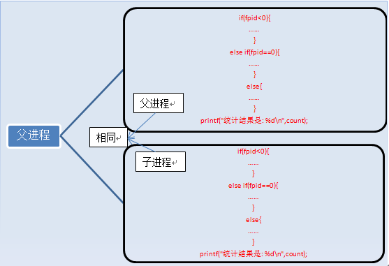
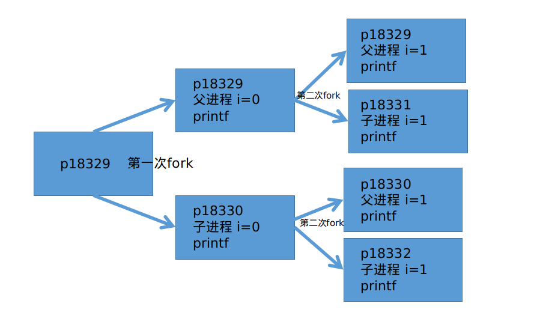

## fork
### 入门知识
  一个进程，包括代码、数据和分配给进程的资源。fork()函数通过系统调用创建一个与原来进程几乎完全相同的进程，fork是把进程当前的情况拷贝一份

  fork调用的一个奇妙之处就是它仅仅被调用一次，却能够返回两次，它可能有三种不同的返回值：
  1. 在父进程中，fork返回新创建子进程的进程ID；
  2.   在子进程中，fork返回0；因为子进程没有子进程，所以其fpid为0.
  3. 如果出现错误，fork返回一个负值；

fork出错可能有两种原因：
   1. 当前的进程数已经达到了系统规定的上限，这时errno的值被设置为EAGAIN。
   2. 系统内存不足，这时errno的值被设置为ENOMEM。

### 第一个fork程序

```c
#include <unistd.h>
#include <stdio.h> 
int main () 
{ 
	pid_t fpid; //fpid表示fork函数返回的值
	int count=0;
	fpid=fork(); 
	if (fpid < 0)  //如果返回值小于0 说明创建进程出错  错误原因有 内存空间不够 进程数超出上限
		printf("error in fork!"); 
	else if (fpid == 0) { //如果返回值是0 说明是子进程
		printf("i am the child process, my process id is %d\n",getpid()); 
		count++;
	}
	else { //如果返回值大于0 说明是父进程
		printf("i am the parent process, my process id is %d\n",getpid()); 
		count++;
	}
	printf("count的值为: %d\n",count);  //这里两个进程的count的值都是1 因为fork函数拷贝了父进程的所有状态
	return 0;
}
/* 样例输出
i am parent process, my process id is 50561
count的值为: 1
i am the child process, my process id is 50562
count的值为: 1
*/
```
如图所示 fork函数的执行过程


我们通过fpid来识别和操作父子进程

### 第二个fork程序

```c
#include <unistd.h>  
#include <stdio.h>  
int main(void)  
{  
   int i=0;  
   printf("i son/pa ppid pid  fpid\n");  
   //ppid指当前进程的父进程pid  
   //pid指当前进程的pid,  
   //fpid指fork返回给当前进程的值  
   for(i=0;i<2;i++){  
       pid_t fpid=fork();  
       if(fpid==0)  
           printf("%d child  %4d %4d %4d\n",i,getppid(),getpid(),fpid);  
       else  
           printf("%d parent %4d %4d %4d\n",i,getppid(),getpid(),fpid);  
   }  
   return 0;  
}  

/* 输出样例
i son/pa ppid pid  fpid
0 parent 17959 18329 18330
1 parent 17959 18329 18331
0 child  18329 18330    0
1 child  18329 18331    0
1 parent 18329 18330 18332
1 child     1 18332    0


为了更好的理解 看的更清晰 更改为 

i son/pa ppid pid  fpid
0 parent 17959 18329 18330
0 child  18329 18330    0
1 parent 17959 18329 18331
1 parent 18329 18330 18332
1 child  18329 18331    0
1 child     1 18332    0

 */
```



如上图所示 一共创建了三个子进程,有6次(2+4) printf的输出
继承关系是 
```shell
17959 -> 18329 -> 18320 
18329 -> 18331
18330 -> 18332
```

上述过程通过图片解释完了之后我们发现,最终打印的内容中pid为18332的进程的父进程id为1,这是因为父进程死亡后子进程不能没有父亲,所以p18332的的父进程置为p1,p1是永远不会死亡的.